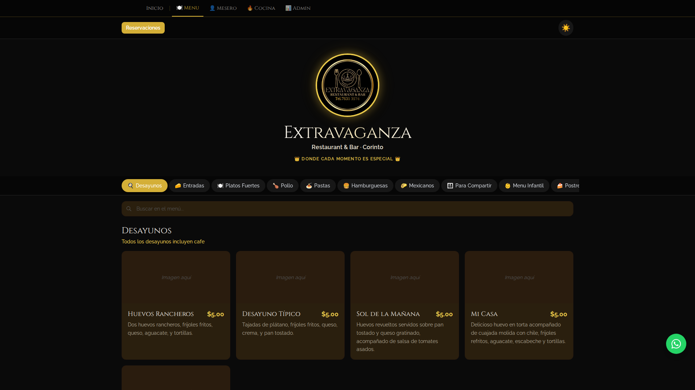
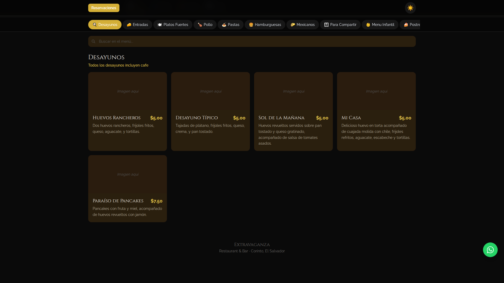
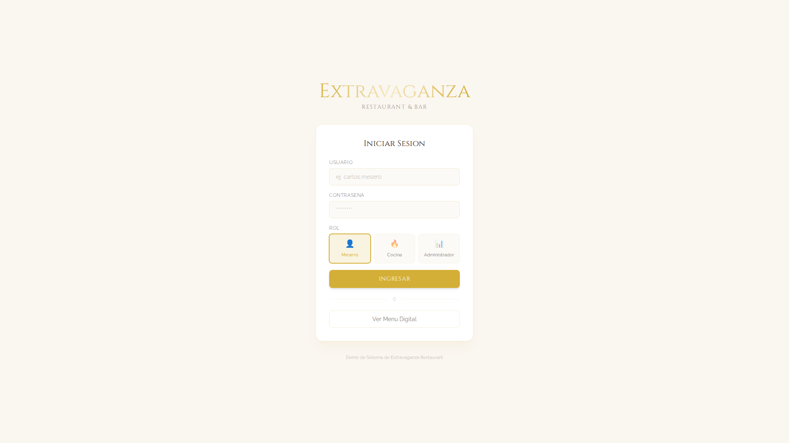
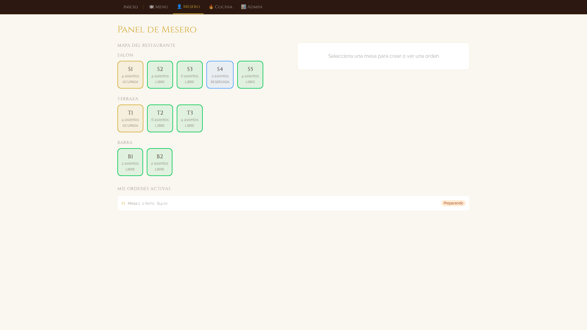
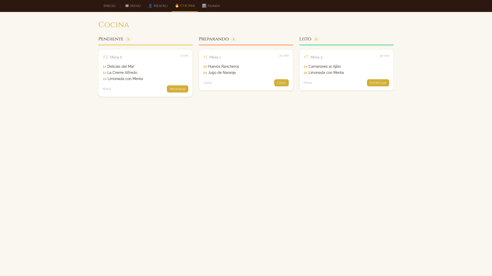
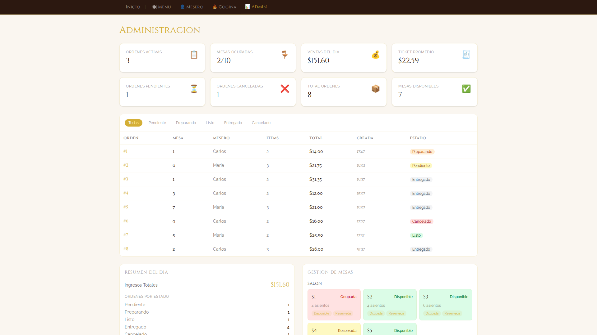
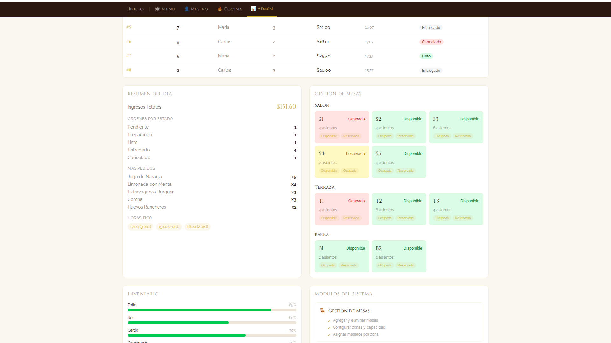
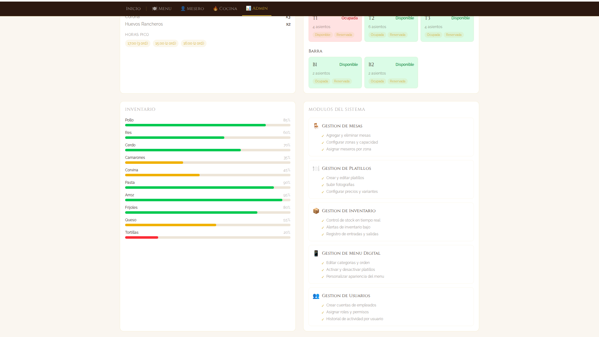

---
pdf_options:
  format: Letter
  margin: 30mm 25mm
  printBackground: true
  headerTemplate: '
Extravaganza Restaurant & Bar - Sistema de Gestion Digital
'
  footerTemplate: '
 / 
'
  displayHeaderFooter: true
stylesheet: https://fonts.googleapis.com/css2?family=Cinzel:wght@400;700&family=Raleway:wght@300;400;600&display=swap
body_class: propuesta
css: |-
  body {
    font-family: 'Raleway', sans-serif;
    color: #2d2d2d;
    line-height: 1.7;
  }
  h1, h2, h3 {
    font-family: 'Cinzel', serif;
    color: #1a1a2e;
  }
  h1 { border-bottom: 3px solid #c9a96e; padding-bottom: 8px; }
  h2 { border-bottom: 2px solid #c9a96e; padding-bottom: 6px; margin-top: 2em; }
  h3 { color: #c9a96e; }
  img { max-width: 100%; border-radius: 8px; box-shadow: 0 4px 12px rgba(0,0,0,0.15); margin: 1em 0; }
  .portada { text-align: center; page-break-after: always; padding-top: 120px; }
  .portada h1 { border: none; font-size: 2.5em; color: #c9a96e; }
  .portada p { font-size: 1.2em; color: #666; }
  ul { list-style-type: none; padding-left: 0; }
  ul li::before { content: "- "; color: #c9a96e; font-weight: bold; }
  table { border-collapse: collapse; width: 100%; margin: 1em 0; }
  th, td { border: 1px solid #ddd; padding: 10px 14px; text-align: left; }
  th { background-color: #1a1a2e; color: #f5f0e8; font-family: 'Cinzel', serif; }
  .page-break { page-break-before: always; }
---

# Extravaganza Restaurant & Bar

## Sistema de Gestion Digital

**Propuesta Tecnica y Funcional**

Corinto, El Salvador

Agosto 2026

## Indice

1. Resumen Ejecutivo
2. Modulo: Menu Digital
3. Modulo: Autenticacion
4. Modulo: Panel de Mesero
5. Modulo: Panel de Cocina
6. Modulo: Panel de Administracion
7. Proximos Pasos (Roadmap)
8. Contacto

---

## 1. Resumen Ejecutivo

El **Sistema de Gestion Digital de Extravaganza** es una plataforma web disenada para digitalizar y optimizar las operaciones diarias del restaurante. El sistema integra cinco modulos principales que cubren desde la experiencia del cliente hasta la gestion administrativa:

| Modulo | Funcion Principal |
|--------|-------------------|
| Menu Digital | Catalogo publico de platillos accesible desde cualquier dispositivo |
| Autenticacion | Control de acceso por roles (Mesero, Cocina, Administrador) |
| Panel de Mesero | Gestion de mesas y toma de ordenes |
| Panel de Cocina | Seguimiento de preparacion de ordenes |
| Panel de Administracion | KPIs, reportes, inventario y gestion operativa |

### Beneficios clave

- Operacion mas agil: ordenes digitales eliminan errores de comunicacion
- Visibilidad en tiempo real del estado de mesas, ordenes e inventario
- Experiencia moderna para el cliente con menu digital y reservaciones
- Base solida para escalar a un sistema completo en la nube

---

## 2. Modulo: Menu Digital

El menu digital es la cara publica del sistema. Los clientes pueden explorarlo desde su celular, tablet o computadora sin necesidad de registrarse.

### Caracteristicas

- **112 platillos** organizados en **18 categorias** (Desayunos, Entradas, Platos Fuertes, Mariscos, Postres, Bebidas, y mas)
- **Busqueda en tiempo real**: filtrado instantaneo por nombre de platillo
- **Modo claro y oscuro**: adaptable a la preferencia del usuario
- **Detalle de platillos**: modal con descripcion completa, precio e imagen
- **Notas por categoria**: informacion contextual como "incluye cafe", "incluye tortillas"
- **Reservaciones via WhatsApp**: boton integrado para reservar mesa directamente
- **Boton flotante de WhatsApp**: acceso rapido para contactar al restaurante

---

## 3. Modulo: Autenticacion

El sistema cuenta con un modulo de autenticacion que controla el acceso a los paneles operativos segun el rol del usuario.

### Roles del sistema

| Rol | Acceso |
|-----|--------|
| **Mesero** | Panel de Mesero (mesas y ordenes) |
| **Cocina** | Panel de Cocina (tablero de preparacion) |
| **Administrador** | Panel de Administracion (KPIs, reportes, inventario, gestion completa) |

### Funcionamiento

- El **menu digital** es de acceso publico, no requiere inicio de sesion
- Los paneles operativos requieren credenciales segun el rol asignado
- Cada rol ve unicamente las herramientas relevantes a su funcion
- La pantalla de inicio permite seleccionar el rol y acceder al panel correspondiente

---

## 4. Modulo: Panel de Mesero

El Panel de Mesero es la herramienta principal para el personal de sala. Permite gestionar mesas y crear ordenes de forma rapida e intuitiva.

### Mapa interactivo de mesas

- **10 mesas** distribuidas en **3 zonas**: Salon, Terraza y Barra
- Estados visuales con codigo de color:
  - **Verde**: Disponible
  - **Rojo**: Ocupada
  - **Amarillo**: Reservada
- Transicion automatica de estado al crear una orden

### Creador de ordenes

- Selector de platillos del menu completo
- Ajuste de cantidades por item
- Asignacion automatica a la mesa seleccionada
- Envio directo al panel de cocina

### Ordenes activas

- Vista de todas las ordenes creadas por el mesero
- Estado actualizado en tiempo real
- Detalle de items, cantidades y mesa asignada

---

## 5. Modulo: Panel de Cocina

El Panel de Cocina muestra las ordenes en un tablero tipo Kanban, facilitando el seguimiento del flujo de preparacion.

### Tablero Kanban

El tablero organiza las ordenes en tres columnas:

| Columna | Descripcion |
|---------|-------------|
| **Pendiente** | Ordenes recien recibidas, esperando preparacion |
| **Preparando** | Ordenes actualmente en preparacion |
| **Listo** | Ordenes terminadas, listas para servir |

### Funcionalidades

- **Tickets detallados**: cada orden muestra mesa, items, cantidades y tiempo transcurrido
- **Animacion visual**: las ordenes nuevas se destacan al llegar
- **Avance con un click**: un solo boton para mover la orden al siguiente estado
- **Tiempo real**: el tablero se actualiza automaticamente conforme cambian los estados

---

## 6. Modulo: Panel de Administracion

El Panel de Administracion ofrece una vista completa del negocio con indicadores, reportes y herramientas de gestion.

### Dashboard de KPIs

8 indicadores clave en tiempo real:

- Ordenes activas y completadas
- Mesas ocupadas y disponibles
- Ventas totales del dia
- Ticket promedio
- Items vendidos
- Tasa de ocupacion

### Tabla de ordenes

- Filtros por estado (Pendiente, Preparando, Listo, Entregado)
- Filas expandibles con detalle completo de cada orden
- Informacion de mesa, hora, items y total

### Gestion de mesas

- Vista organizada por zona (Salon, Terraza, Barra)
- Cambio de estado directo desde el panel
- Resumen visual de ocupacion por zona

### Resumen diario

- Ingresos totales del dia
- Ordenes completadas por estado
- Top 5 platillos mas vendidos
- Horas pico de actividad

### Control de inventario

- Lista de productos con niveles de stock
- Alertas visuales para stock bajo
- Actualizacion de cantidades desde el panel

### Grafica de ventas

- Grafica de ventas por hora del dia
- Visualizacion basada en datos reales de ordenes

---

## 7. Proximos Pasos (Roadmap)

### Fase 1: Prototipo Funcional (Actual)

El sistema actual es un prototipo completamente funcional que opera en el navegador. Todos los modulos estan implementados y operativos con datos en memoria.

- Menu digital completo con 112 platillos
- 5 modulos operativos (Menu, Login, Mesero, Cocina, Admin)
- Interfaz responsiva para movil, tablet y escritorio

### Fase 2: Integracion con la Nube

Conexion del sistema con un servicio en la nube (Firebase o Supabase) para persistencia de datos y funcionalidades avanzadas:

- **Autenticacion real** con cuentas individuales para cada empleado
- **Base de datos en tiempo real** para mesas, ordenes e inventario
- **Sincronizacion instantanea** entre todos los dispositivos
- **Notificaciones push** entre cocina y meseros (orden lista, nueva orden)
- **Historial de datos** para reportes y analisis

### Fase 3: Despliegue en Produccion

Puesta en marcha del sistema para uso diario en el restaurante:

- **Hosting y dominio** propio (ej. sistema.extravaganza.com.sv)
- **PWA (Progressive Web App)** para instalar en tablets y celulares como app nativa
- **Reportes historicos** con graficas de ventas por dia, semana y mes
- **Exportacion de datos** a Excel/PDF para contabilidad
- **Soporte y mantenimiento** continuo

---

## 8. Contacto

Para mas informacion sobre el sistema o para coordinar los proximos pasos:

**Extravaganza Restaurant & Bar**
Corinto, El Salvador

---

*Documento generado en agosto 2026*
